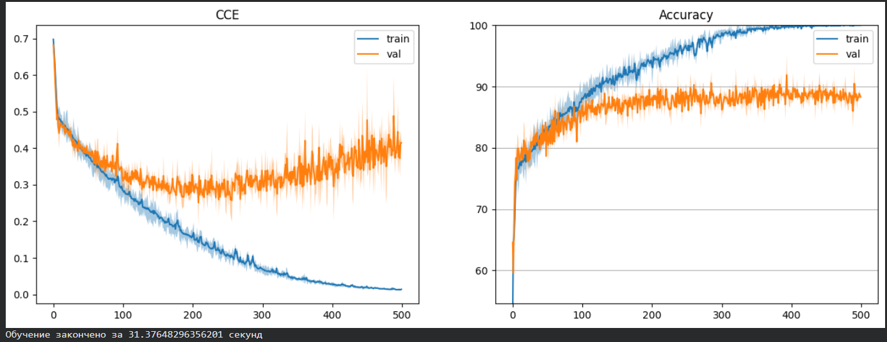
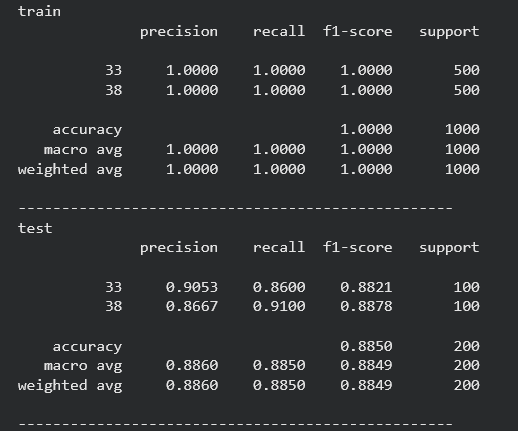
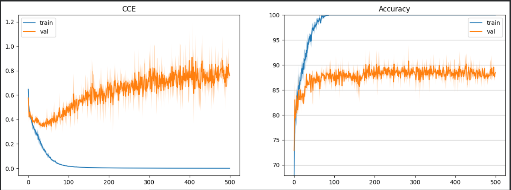
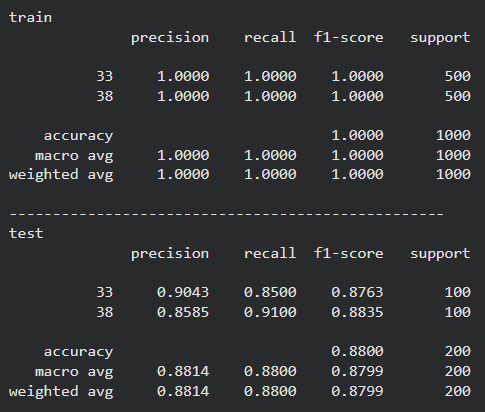
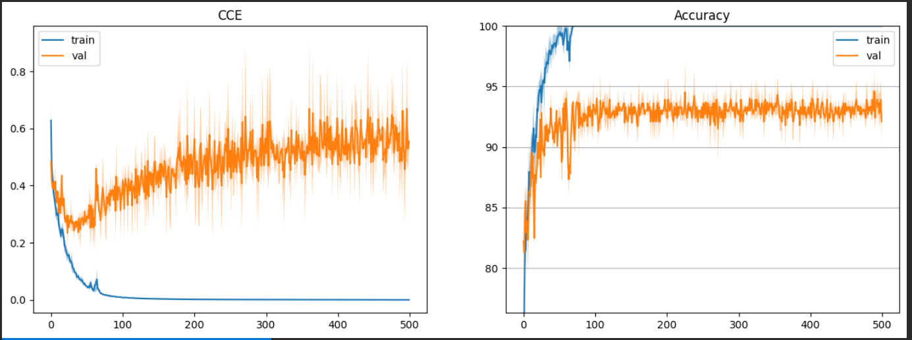
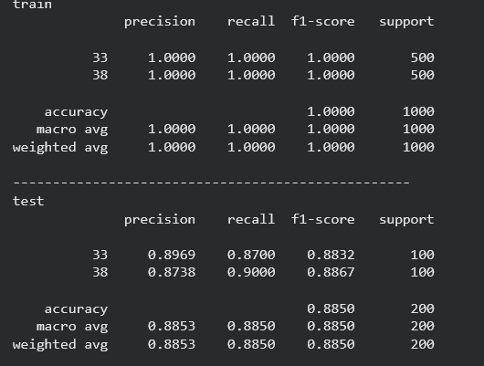

# Отчёт по Лабораторной работе №2

**Тема:** Обучение сверточной нейронной сети на CIFAR-100, сравнение стратегий уменьшения размерности (stride / max pooling / avg pooling), выбор лучшей модели и экспорт в ONNX.

## Цель работы

1. Подготовка окружения и данных
2. Реализовать архитектуру CNN модели
3. Сравнения разных пуллингов stride / max / avg
4. Сделать сравнительную таблицу с результатами обучения
5. Экспорт лучшей модели в ONNX

## 1. Подготовка окружения и данных

### 1.1. Настройка окружения

Подключены основные библиотеки PyTorch, NumPy, инструменты визуализации и пакеты для ONNX:

```python
!pip install onnx onnxscript
!pip install torchsummary onnx onnxruntime
```

### 1.2. Использование GPU

Для ускорения обучения проверена доступность GPU (`!nvidia-smi`) и выбран `device`:

```python
device = torch.device('cuda' if torch.cuda.is_available() else 'cpu')
```

Все вычисления выполняются на GPU через `.to(device)`.

### 1.3. Загрузка CIFAR-100 и выбор классов

Данные CIFAR-100 скачиваются и распаковываются:

```python
!wget -q https://www.cs.toronto.edu/~kriz/cifar-100-python.tar.gz
!tar -xzf cifar-100-python.tar.gz
```

Выбранные классы по варианту:

Согласно варианту, были выбраны 3 класса из набора данных CIFAR-100:
Класс № [Номер группы + 11] = [Название класса]
Класс № [Номер варианта + 37] = [Название класса]
Класс № [Произвольный третий класс] = [Название класса]

```
GROUP = 22
VARIANT = 1
CLASSES = [GROUP + 11, VARIANT + 37]
```

Пример изображения из выборки CIFAR100:


## 2. Архитектура CNN

### 2.1. Нормализация

В модель добавлен слой `Normalize`:

- перевод значений пикселей из `0..255` в `0..1`
- нормализация по mean/std CIFAR-100
- преобразование NHWC → NCHW (как требует `Conv2d`)

```python
x = input / 255.0
x = (x - self.mean) / self.std
return x.permute(0, 3, 1, 2)
```

### 2.2. CNN-модель

Модель `Cifar100_CNN` состоит из следующих последовательно соединённых слоёв:

```python
class Cifar100_CNN(nn.Module):
    def __init__(self, hidden_size=32, classes=100):
        super(Cifar100_CNN, self).__init__()
        self.seq = nn.Sequential(
            Normalize([0.5074,0.4867,0.4411],[0.2011,0.1987,0.2025]),
            nn.Conv2d(3, hidden_size, 5, stride=4, padding=2),
            nn.ReLU(),
            nn.Conv2d(hidden_size, hidden_size*2, 3, stride=1, padding=1),
            nn.ReLU(),
            nn.AvgPool2d(4),
            nn.Flatten(),
            nn.Linear(hidden_size*8, classes),
        )
    def forward(self, input):
        return self.seq(input)
```

Модель Cifar100_CNN представляет собой компактную сверточную нейронную сеть, специально разработанную для классификации изображений из датасета CIFAR-100.Архитектура состоит из последовательно соединённых слоёв.

Первый сверточный слой использует ядро 5×5 со stride=4 для значительного уменьшения размерности, а второй слой с ядром 3×3 и stride=1 служит для извлечения более детальных признаков. Модель демонстрирует эффективное сочетание методов уменьшения размерности через stride и пуллинг, что позволяет обрабатывать изображения 32×32 пикселя с минимальным количеством параметров.

### 2.3 Выбор функции потерь и оптимизатора градиентного спуска

```python
criterion = nn.CrossEntropyLoss()
# используется SGD c momentum
optimizer = optim.SGD(model.parameters(), lr=5e-3, momentum=0.9)
```

Для обучения модели была выбрана функция потерь CrossEntropyLoss.
В качестве оптимизатора использовался Stochastic Gradient Descent (SGD) с моментом 0.9 и скоростью обучения 5e-3, что позволяет плавно обновлять веса модели.

### 2.4 Обучение модели по эпохам

```python
EPOCHS = 500
REDRAW_EVERY = 20
steps_per_epoch = len(dataloader['train'])
steps_per_epoch_val = len(dataloader['test'])
# NEW
pbar = tqdm(total=EPOCHS*steps_per_epoch)
losses = []
losses_val = []
passed = 0
for epoch in range(EPOCHS):  # проход по набору данных несколько раз
    #running_loss = 0.0
    tmp = []
    model.train()
    for i, batch in enumerate(dataloader['train'], 0):
        # получение одного минибатча; batch это двуэлементный список из [inputs, labels]
        inputs, labels = batch
        # на GPU
        inputs, labels = inputs.to(device), labels.to(device)

        # очищение прошлых градиентов с прошлой итерации
        optimizer.zero_grad()

        # прямой + обратный проходы + оптимизация
        outputs = model(inputs)
        loss = criterion(outputs, labels)
        #loss = F.cross_entropy(outputs, labels)
        loss.backward()
        optimizer.step()

        # для подсчёта статистик
        #running_loss += loss.item()
        accuracy = (labels.detach().argmax(dim=-1)==outputs.detach().argmax(dim=-1)).\
                    to(torch.float32).mean().cpu()*100
        tmp.append((loss.item(), accuracy.item()))
        pbar.update(1)
    #print(f'[{epoch + 1}, {i + 1:5d}] loss: {running_loss / steps_per_epoch:.3f}')
    losses.append((np.mean(tmp, axis=0),
                   np.percentile(tmp, 25, axis=0),
                   np.percentile(tmp, 75, axis=0)))
    #running_loss = 0.0
    tmp = []
    model.eval()
    with torch.no_grad(): # отключение автоматического дифференцирования
        for i, data in enumerate(dataloader['test'], 0):
            inputs, labels = data
            # на GPU
            inputs, labels = inputs.to(device), labels.to(device)

            outputs = model(inputs)
            loss = criterion(outputs, labels)
            #running_loss += loss.item()
            accuracy = (labels.argmax(dim=-1)==outputs.argmax(dim=-1)).\
                        to(torch.float32).mean().cpu()*100
            tmp.append((loss.item(), accuracy.item()))
    #print(f'[{epoch + 1}, {i + 1:5d}] val loss: {running_loss / steps_per_epoch_val:.3f}')
    losses_val.append((np.mean(tmp, axis=0),
                       np.percentile(tmp, 25, axis=0),
                       np.percentile(tmp, 75, axis=0)))
    if (epoch+1) % REDRAW_EVERY != 0:
        continue
    clear_output(wait=False)
    passed += pbar.format_dict['elapsed']
    pbar = tqdm(total=EPOCHS*steps_per_epoch, miniters=5)
    pbar.update((epoch+1)*steps_per_epoch)
    x_vals = np.arange(epoch+1)
    _, ax = plt.subplots(1, 2, figsize=(15, 5))
    stats = np.array(losses)
    stats_val = np.array(losses_val)
    ax[1].set_ylim(stats_val[:, 0, 1].min()-5, 100)
    ax[1].grid(axis='y')
    for i, title in enumerate(['CCE', 'Accuracy']):
        ax[i].plot(x_vals, stats[:, 0, i], label='train')
        ax[i].fill_between(x_vals, stats[:, 1, i],
                           stats[:, 2, i], alpha=0.4)
        ax[i].plot(x_vals, stats_val[:, 0, i], label='val')
        ax[i].fill_between(x_vals,
                           stats_val[:, 1, i],
                           stats_val[:, 2, i], alpha=0.4)
        ax[i].legend()
        ax[i].set_title(title)
    plt.show()
print('Обучение закончено за %s секунд' % passed)
```

### 2.5 Результат обучения




На тренировочных данных модель достигла идеальных результатов (accuracy 1.000), что указывает на возможное переобучение.
На тестовых данных точность снизилась до 0.885, что демонстрирует хорошую, но не идеальную обобщающую способность.

## 3. Сравнения разных пуллингов stride / max / avg

Были исследованы три различные стратегии уменьшения размерности признаковых карт в сверточной нейронной сети.

### 3.1 Пуллинг с помощью шага свёртки stride

- Это увеличение шага в свёрточном слое: фильтр перепрыгивает через пиксели, пропуская информацию между ними для быстрого уменьшения размерности.

```python
class Cifar100_CNN_Stride(nn.Module):
    def __init__(self, hidden_size=32, classes=len(CLASSES)):
        super().__init__()  # Важно!
        self.seq = nn.Sequential(
            Normalize([0.5074,0.4867,0.4411],[0.2011,0.1987,0.2025]),
            nn.Conv2d(3, hidden_size, 5, stride=4, padding=2),  # 32→8
            nn.ReLU(),
            nn.Conv2d(hidden_size, hidden_size*2, 3, stride=1, padding=1),  # 8→8
            nn.ReLU(),
            nn.Flatten(),
            nn.Linear(hidden_size*2 * 8 * 8, classes),
        )

    def forward(self, x):
        return self.seq(x)
```

Ниже представлен график кривые обучения свёрточной нейронной сети при использовании шага свёртки в качестве метода уменьшения размерности через stride



Модель очень быстро сходится на обучающей выборке, достигая 100% точности. Однако на валидационной выборке наблюдается рост функции потерь после начального снижения и стабилизация точности на уровне около 88%. Это свидетельствует о выраженном переобучении, вызванном потерей пространственной информации из-за агрессивного увеличения шага свёртки.

Время обучения:

- Обучение закончено за 27.61451745033264 секунд

Результат обучения


Из таблицы классификационных метрик видно, что на обучающей выборке модель демонстрирует идеальные показатели точности, полноты и F1-меры для всех классов. Однако на тестовой выборке общая точность снижается до 88%, при этом качество классификации заметно различается между классами. Наиболее слабые результаты наблюдаются для одного из классов, что подтверждает низкую обобщающую способность модели при использовании уменьшения размерности через шаг свёртки.

### 3.2 Макс-пуллинг (Max Pooling)

- Это отдельный слой, который берёт квадрат пикселей и оставляет только самый яркий/важный, выбрасывая всё остальное.

```python
class Cifar100_CNN_MaxPool(nn.Module):
    def __init__(self, hidden_size=32, classes=len(CLASSES)):
        super().__init__()
        self.seq = nn.Sequential(
            Normalize([0.5074,0.4867,0.4411],[0.2011,0.1987,0.2025]),
            nn.Conv2d(3, hidden_size, 5, padding=2),
            nn.ReLU(),
            nn.MaxPool2d(2),  # MaxPool
            nn.Conv2d(hidden_size, hidden_size*2, 3, padding=1),
            nn.ReLU(),
            nn.MaxPool2d(2),  # MaxPool
            nn.Flatten(),
            nn.Linear(hidden_size*2*8*8, classes),
        )
    def forward(self, input):
      return self.seq(input)
```

- Ниже представлен график кривые обучения свёрточной нейронной сети при использовании MaxPooling



Модель демонстрирует устойчивое снижение потерь и рост точности. Разрыв между кривыми обучения и валидации минимален. Функция потерь на валидации остается низкой, а точность стабилизируется на уровне 92–94%. Это указывает на эффективное обобщение и меньшую склонность к переобучению по сравнению со стратегией stride.

Время обучения:

- Обучение закончено за 43.329933881759644 секунд

Результат обучения


Таблица классификационных метрик подтверждает высокое качество модели с MaxPooling: на тестовой выборке достигается точность 93%, а значения precision, recall и F1-меры являются высокими и более равномерными для всех классов по сравнению с первым вариантом. Это указывает на способность MaxPooling сохранять наиболее значимые признаки изображения и повышать устойчивость модели к вариациям входных данных.

### 3.3 Усредняющий пуллинг (Average Pooling)

- Это отдельный слой, который берёт квадрат пикселей и вычисляет их среднее значение, сохраняя общую картину.

```python
class Cifar100_CNN_AvgPool(nn.Module):
    def __init__(self, hidden_size=32, classes=100):
        super().__init__()
        self.seq = nn.Sequential(
            Normalize([0.5074,0.4867,0.4411],[0.2011,0.1987,0.2025]),
            nn.Conv2d(3, hidden_size, kernel_size=5, stride=1, padding=2),
            nn.ReLU(),
            nn.Conv2d(hidden_size, hidden_size*2, kernel_size=3, stride=1, padding=1),
            nn.ReLU(),
            nn.AvgPool2d(kernel_size=4),
            nn.Flatten(),
            nn.Linear(hidden_size*2 * 8 * 8, classes),
        )

    def forward(self, x):
        return self.seq(x)
```

- Ниже представлен график кривые обучения свёрточной нейронной сети при использовании AveragePooling


Обучение проходит успешно, достигается высокая точность на обучающем наборе. Однако функция потерь на валидации выше и показывает более заметные колебания, чем у MaxPooling. Это говорит о том, что усреднение может приводить к потере информативных деталей и менее устойчивому выделению ключевых признаков.

Время обучения:

- Обучение закончено за 67.91825485229492 секунд

Результат обучения


Из таблицы метрик следует, что модель с AveragePooling демонстрирует точность 88 .50% на тестовой выборке, что сопоставимо с вариантом MaxPooling. Тем не менее, значения F1-меры по отдельным классам несколько ниже и менее устойчивы, что указывает на более слабое выделение ключевых признаков при использовании усредняющего пуллинга по сравнению с максимальным.

## 4. Сравнительная таблица результатов обучения

| Критерий / Метод                   | Stride (шаг свёртки)                     | Max Pooling            | Average Pooling |
| ---------------------------------- | ---------------------------------------- | ---------------------- | --------------- |
| Тестовая точность (Accuracy)       | ~88.5%                                   | ~93.3%                 | ~88.5%          |
| Степень переобучения               | Высокая (большой разрыв train/test loss) | Низкая                 | Средняя         |
| Стабильность валидационной кривой  | Нестабильная                             | Стабильная             | Средняя         |
| Время обучения (500 эпох)          | ~28 сек                                  | ~43 сек                | ~68 сек         |
| Качество по F1-мере (класс Rocket) | 0.81                                     | 0.93                   | 0.87            |
| Основной принцип работы            | Пропуск информации                       | Выбор максимума        | Усреднение      |
| Вывод                              | сильно переобучается                     | Лучший баланс качества | Стабильно       |

## 5. Экспорт лучшей модели в ONNX

В качестве лучшей была выбрана модель, использующая Max Pooling, как показавшая наивысшую точность на тестовой выборке (93.3%) при минимальных признаках переобучения.

## Вывод

В ходе лабораторной работы была разработана и обучена свёрточная нейронная сеть для классификации изображений датасета CIFAR-100 по трём выбранным классам с использованием GPU. Были экспериментально исследованы три метода уменьшения пространственной размерности карт признаков: агрессивный шаг свёртки (stride), максимизирующий пулинг (MaxPooling) и усредняющий пулинг (AvgPooling).

Результаты показали, что MaxPooling является наиболее эффективной стратегией для данной задачи. Она обеспечивает наилучшее качество классификации (тестовая точность ~93.3%) благодаря способности сохранять наиболее информативные признаки и подавлять шум, а также демонстрирует наименьшие признаки переобучения. Стратегия stride, хотя и обучается быстрее всего, приводит к значительной потере информации и сильному переобучению. AvgPooling показывает средние результаты, но уступает MaxPooling в точности, возможно, из-за чрезмерного сглаживания важных деталей.

Лучшая модель на основе MaxPooling была успешно экспортирована в формат ONNX, что позволяет использовать её в различных производственных средах.
