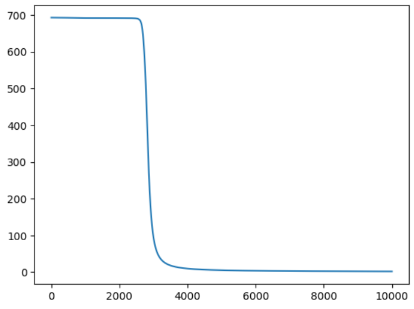

# Отчёт. Лабораторная работа №1. Введение в глубокое обучение

## Задание

Цель работы — познакомиться с фреймворком PyTorch и выполнить несколько заданий:

- Регрессия с использованием теоремы универсальной аппроксимации и ручного дифференцирования.
- Бинарная классификация с автодифференцированием в PyTorch.
- Обучение полносвязной нейронной сети для классификации изображений из набора данных CIFAR-100.

## Задание №1. Регрессия с использованием теоремы универсальной аппроксимации и ручного дифференцирования

Теорема универсальной аппроксимации утверждает, что нейронная сеть с одним скрытым слоем и достаточным количеством нейронов может аппроксимировать любую непрерывную функцию с заданной точностью.

В этом задании задача состояла в том, чтобы обучить нейронную сеть решать задачу регрессии. Это задача, где требуется предсказать непрерывное значение. Для обучения использовался **градиентный спуск**, требующий вычисления производных.

**Ручное дифференцирование** включает аналитическое вычисление производных функции потерь по весам сети. В данном случае использовалось правило цепочки для многослойных сетей.

После подготовки данных и инициализации нейронной сети, использовалась библиотека **PyTorch** для вычислений и **matplotlib** для визуализации результатов.

### Результат обучения:

На первом графике показан процесс подготовки данных, затем на втором — как после обучения нейронной сети ошибка уменьшается, и модель успешно аппроксимирует сигмоидальную функцию, избавляясь от шума.

На втором графике видно, что функция аппроксимируется довольно точно после обучения.

## Задание №2. Бинарная классификация с использованием автодифференцирования в PyTorch

В этой части мы решали задачу бинарной классификации, где модель должна предсказать один из двух классов (например, 0 или 1).

После подготовки данных, для которой использовалась искусственная выборка с двумя классами, мы обучали нейронную сеть с автодифференцированием с использованием алгоритма **градиентного спуска** и определения функции потерь, подходящей для бинарной классификации.

Мы использовали новую функцию активации, которая подошла лучше для бинарной классификации.

### Результат обучения:

После того как функция потерь начала стремительно уменьшаться, мы проверили результаты. Сеть научилась различать два класса — жёлтые и фиолетовые точки, что подтверждает успешное обучение.

На графиках видно, что функция потерь уменьшается, а также, что сеть успешно решает задачу классификации.

## Задание №3. Классификация изображений CIFAR-100

Задача классификации изображений CIFAR-100 заключается в том, чтобы модель предсказала, к какому из 100 классов относится изображение.

Датасет CIFAR-100 содержит 60 000 цветных изображений размером 32×32 пикселя, равномерно распределённых по 100 классам. Мы выбрали для классификации три конкретных класса: изображения с яблоками (класс 0), лесами (класс 33) и со львами (класс 43).

После загрузки и подготовки данных, была создана модель **многослойного перцептрона (MLP)** с одним скрытым слоем. В процессе обучения использовался **оптимизатор градиентного спуска**, а для вычисления потерь применялась **кросс-энтропийная функция потерь**.

### Результаты обучения:

После обучения модели были получены хорошие результаты, что подтвердилось визуализацией разделяющих границ, а также точностью классификации на тестовой выборке.

Сначала были выбраны нужные классы для классификации (изображения с лесами). Далее была построена модель для их классификации.

Затем была проведена проверка качества модели, которая показала высокую точность на тестовой выборке.

**Ссылка на выполнение работы в Google Colab:** [Google Colab](https://colab.research.google.com/drive/1sdnqzi0pruL70lKpmJQ9ZsTUpFL2r8Nu?usp=sharing)

Таким образом, в ходе лабораторной работы была продемонстрирована реализация различных техник глубокого обучения с использованием библиотеки PyTorch, включая регрессию, бинарную классификацию и классификацию изображений.
