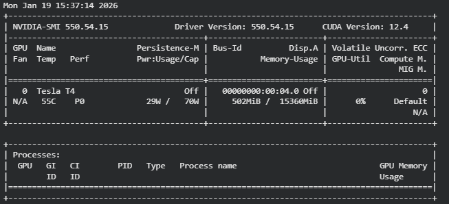
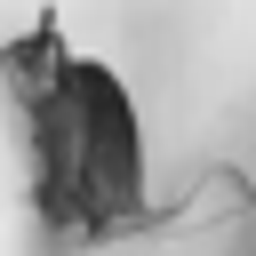
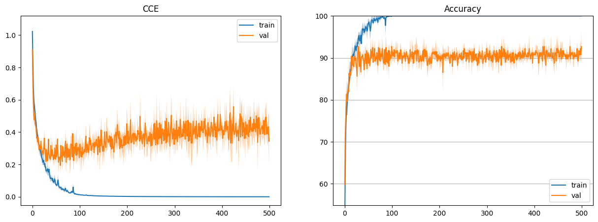
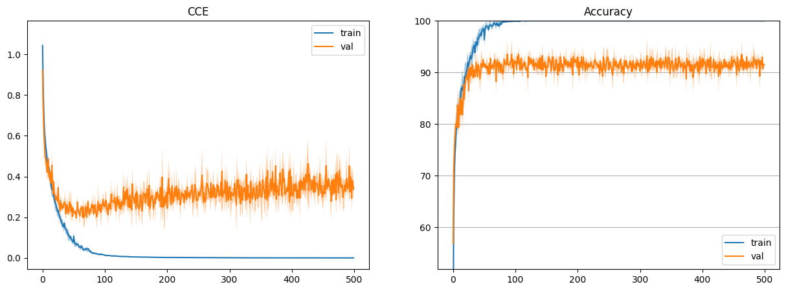
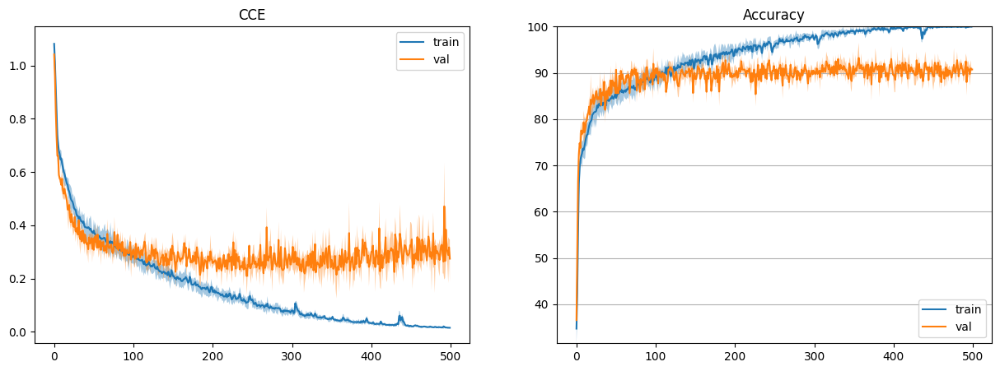
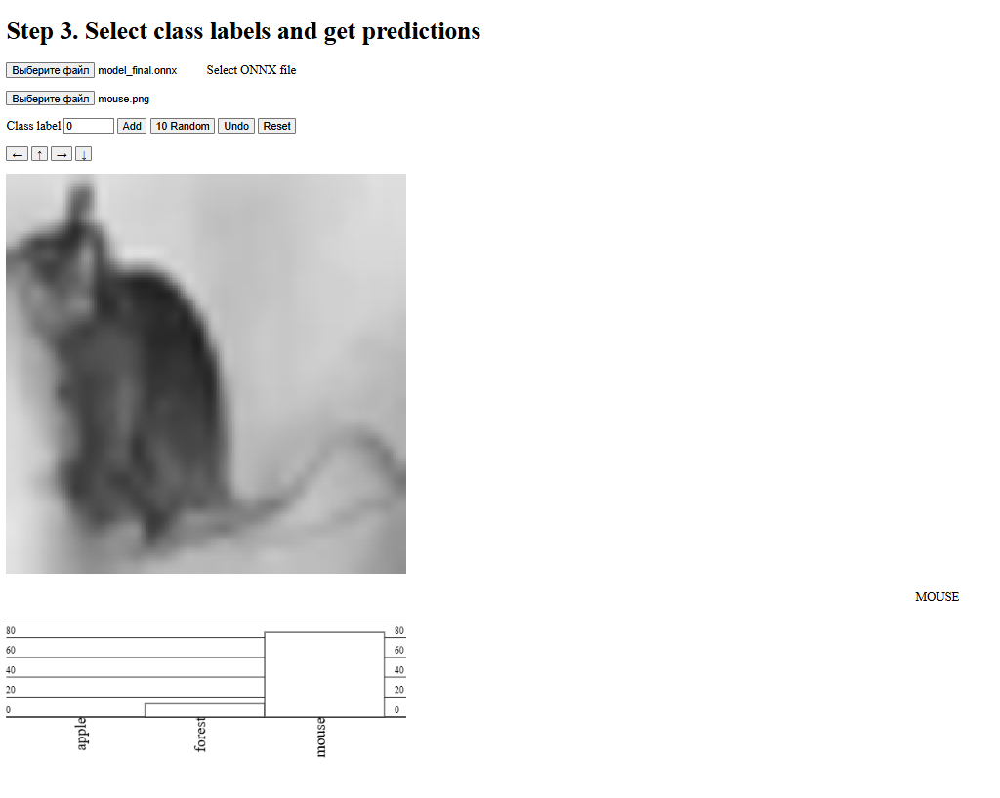

# Отчёт по Лабораторной работе №2

**Тема:** Обучение сверточной нейронной сети на CIFAR-100, сравнение стратегий уменьшения размерности (stride / max pooling / avg pooling), выбор лучшей модели и экспорт в ONNX.

## Цель работы

1. Подготовка окружения и данных
2. Реализовать архитектуру CNN модели
3. Сравнения разных пуллингов stride / max / avg
4. Сделать сравнительную таблицу с результатами обучения
5. Экспорт лучшей модели в ONNX

## 1. Подготовка окружения и данных

### 1.1. Настройка окружения

Подключены основные библиотеки PyTorch, NumPy, инструменты визуализации и пакеты для ONNX:

```python
import numpy as np
import torch
import torch.optim as optim
import torch.nn as nn
import torch.nn.functional as F
from torch.utils.data import TensorDataset, DataLoader
from torchsummary import summary
import pickle
from sklearn.metrics import classification_report
from PIL import Image
from tqdm.auto import tqdm
from IPython.display import clear_output
import matplotlib.pyplot as plt
%matplotlib inline

!pip install onnx onnxscript
!pip install torchsummary onnx onnxruntime
```

### 1.2. Использование GPU

Для ускорения обучения проверена доступность GPU (`!nvidia-smi`) и выбран `device`:

```python
device = torch.device('cuda' if torch.cuda.is_available() else 'cpu')
```

Все вычисления выполняются на GPU через `.to(device)`.



### 1.3. Загрузка CIFAR-100 и выбор классов

Данные CIFAR-100 скачиваются и распаковываются:

```python
!wget -q https://www.cs.toronto.edu/~kriz/cifar-100-python.tar.gz
!tar -xzf cifar-100-python.tar.gz
```

Выбранные классы по варианту:

Согласно варианту, были выбраны 3 класса из набора данных CIFAR-100:
Класс № [Номер группы + 11] = [Название класса]
Класс № [Номер варианта + 37] = [Название класса]

```
CLASSES = [0, 33, 50]
```

Пример изображения из выборки CIFAR100:



## 2. Архитектура CNN

### 2.1. Нормализация

Создан класс для `Normalize` нормализации изображений:

- перевод значений пикселей из `0..255` в `0..1`
- нормализация по mean/std CIFAR-100
- преобразование NHWC → NCHW (как требует `Conv2d`)

```python
class Normalize(nn.Module):
    def __init__(self, mean, std):
        super(Normalize, self).__init__()
        self.mean = torch.tensor(mean).to(device)
        self.std = torch.tensor(std).to(device)

    def forward(self, input):
        x = input / 255.0
        x = x - self.mean
        x = x / self.std
        return x.permute(0, 3, 1, 2)
```

### 2.2. CNN-модель

Модель `Cifar100_CNN` состоит из следующих последовательно соединённых слоёв:

```python
class Cifar100_CNN(nn.Module):
    def __init__(self, hidden_size=32, classes=100):
        super(Cifar100_CNN, self).__init__()
        self.seq = nn.Sequential(
            Normalize([0.5074,0.4867,0.4411],[0.2011,0.1987,0.2025]),
            nn.Conv2d(3, HIDDEN_SIZE, 5, stride=4, padding=2),
            nn.ReLU(),
            nn.Conv2d(HIDDEN_SIZE, HIDDEN_SIZE*2, 3, stride=1, padding=1),
            nn.ReLU(),
            nn.AvgPool2d(4),
            nn.Flatten(),
            nn.Linear(HIDDEN_SIZE*8, classes),
        )

    def forward(self, input):
        return self.seq(input)
```

Модель Cifar100_CNN представляет собой компактную сверточную нейронную сеть, разработанную для классификации изображений. Архитектура состоит из последовательно соединённых слоёв.

Первый сверточный слой использует ядро 5×5 со stride=4 для значительного уменьшения размерности, а второй слой с ядром 3×3 и stride=1 служит для извлечения более детальных признаков. Модель демонстрирует эффективное сочетание методов уменьшения размерности через stride и пуллинг, что позволяет обрабатывать изображения 32×32 пикселя с минимальным количеством параметров.

### 2.3 Выбор функции потерь и оптимизатора градиентного спуска

```python
criterion = nn.CrossEntropyLoss()
optimizer = optim.SGD(model.parameters(), lr=5e-3, momentum=0.9)
```

Для обучения модели была выбрана функция потерь CrossEntropyLoss.
В качестве оптимизатора использовался Stochastic Gradient Descent (SGD) с моментом 0.9 и скоростью обучения 5e-3, что позволяет плавно обновлять веса модели.

### 2.4 Обучение модели по эпохам

Цикл обучения реализован на 500 эпохах с расчётом метрик на каждой итерации. Код включает перевод модели в состояния .train() и .eval(), а также автоматическую визуализацию графиков потерь (CCE) и точности (Accuracy).

```python
for epoch in range(EPOCHS):
    model.train()
    for inputs, labels in dataloader['train']:
        inputs, labels = inputs.to(device), labels.to(device)
        
        optimizer.zero_grad()            # Обнуление градиентов
        outputs = model(inputs)          # Прямой проход
        loss = criterion(outputs, labels) # Расчет функции потерь
        loss.backward()                  # Обратный проход (Backprop)
        optimizer.step()                 # Обновление весов
        
    # Валидация
    model.eval()
    with torch.no_grad():
        for inputs, labels in dataloader['test']:
            inputs, labels = inputs.to(device), labels.to(device)
            outputs = model(inputs)
            # Расчет точности и лосса на тестовой выборке...
```

### 2.5 Результат обучения



```
train
              precision    recall  f1-score   support

           0     1.0000    1.0000    1.0000       500
          33     1.0000    1.0000    1.0000       500
          50     1.0000    1.0000    1.0000       500

    accuracy                         1.0000      1500
   macro avg     1.0000    1.0000    1.0000      1500
weighted avg     1.0000    1.0000    1.0000      1500

--------------------------------------------------
test
              precision    recall  f1-score   support

           0     0.9684    0.9200    0.9436       100
          33     0.9010    0.9100    0.9055       100
          50     0.8558    0.8900    0.8725       100

    accuracy                         0.9067       300
   macro avg     0.9084    0.9067    0.9072       300
weighted avg     0.9084    0.9067    0.9072       300

--------------------------------------------------

```

На тренировочных данных модель достигла идеальных результатов (accuracy 1.000), что указывает на возможное переобучение.
На тестовых данных точность снизилась до 0.9067, что демонстрирует хорошую, но не идеальную обобщающую способность.

## 3. Сравнения разных пуллингов stride / max / avg

Были исследованы три различные стратегии уменьшения размерности признаковых карт в сверточной нейронной сети.

### 3.1 Пуллинг с помощью шага свёртки stride

- Это увеличение шага в свёрточном слое: фильтр перепрыгивает через пиксели, пропуская информацию между ними для быстрого уменьшения размерности.

```python
class Cifar100_CNN_Stride(nn.Module):
    def __init__(self, hidden_size=32, classes=3):
        super(Cifar100_CNN_Stride, self).__init__()
        self.seq = nn.Sequential(
            Normalize([0.5074,0.4867,0.4411],[0.2011,0.1987,0.2025]),
            # Уменьшаем в 4 раза (32 -> 8) за счет stride=4
            nn.Conv2d(3, hidden_size, 5, stride=4, padding=2),
            nn.ReLU(),
            # Уменьшаем еще в 4 раза (8 -> 2) за счет stride=4
            nn.Conv2d(hidden_size, hidden_size*2, 3, stride=4, padding=1),
            nn.ReLU(),
            nn.Flatten(),
            # 2*2 (размер картинки) * hidden_size*2 (каналы) = hidden_size * 8
            nn.Linear(hidden_size * 8, classes),
        )

    def forward(self, input):
        return self.seq(input)
```

Ниже представлен график кривые обучения свёрточной нейронной сети при использовании шага свёртки в качестве метода уменьшения размерности через stride


Модель очень быстро сходится на обучающей выборке, достигая 100% точности. Однако на валидационной выборке наблюдается рост функции потерь после начального снижения и стабилизация точности на уровне около 88%. Это свидетельствует о выраженном переобучении, вызванном потерей пространственной информации из-за агрессивного увеличения шага свёртки.

Время обучения:

- Обучение закончено за 108.93040370941162 секунд

Результат обучения
```
train
              precision    recall  f1-score   support

           0     1.0000    1.0000    1.0000       500
          33     1.0000    1.0000    1.0000       500
          50     1.0000    1.0000    1.0000       500

    accuracy                         1.0000      1500
   macro avg     1.0000    1.0000    1.0000      1500
weighted avg     1.0000    1.0000    1.0000      1500

--------------------------------------------------
test
              precision    recall  f1-score   support

           0     0.9271    0.8900    0.9082       100
          33     0.7685    0.8300    0.7981       100
          50     0.8021    0.7700    0.7857       100

    accuracy                         0.8300       300
   macro avg     0.8326    0.8300    0.8307       300
weighted avg     0.8326    0.8300    0.8307       300

--------------------------------------------------
```

Из таблицы классификационных метрик видно, что на обучающей выборке модель демонстрирует идеальные показатели точности, полноты и F1-меры для всех классов. Однако на тестовой выборке общая точность снижается до 83%, при этом качество классификации заметно различается между классами. Наиболее слабые результаты наблюдаются для одного из классов, что подтверждает низкую обобщающую способность модели при использовании уменьшения размерности через шаг свёртки.

### 3.2 Макс-пуллинг (Max Pooling)

- Это отдельный слой, который берёт квадрат пикселей и оставляет только самый яркий/важный, выбрасывая всё остальное.

```python
class Cifar100_CNN_Max(nn.Module):
    def __init__(self, hidden_size=32, classes=3):
        super(Cifar100_CNN_Max, self).__init__()
        self.seq = nn.Sequential(
            Normalize([0.5074,0.4867,0.4411],[0.2011,0.1987,0.2025]),
            nn.Conv2d(3, hidden_size, 5, stride=1, padding=2),
            nn.ReLU(),
            nn.MaxPool2d(4), # Уменьшаем 32 -> 8
            nn.Conv2d(hidden_size, hidden_size*2, 3, stride=1, padding=1),
            nn.ReLU(),
            nn.MaxPool2d(4), # Уменьшаем 8 -> 2
            nn.Flatten(),
            nn.Linear(hidden_size * 8, classes),
        )

    def forward(self, input):
        return self.seq(input)
```

- Ниже представлен график кривые обучения свёрточной нейронной сети при использовании MaxPooling



Модель демонстрирует устойчивое снижение потерь и рост точности. Разрыв между кривыми обучения и валидации минимален. Функция потерь на валидации остается низкой, а точность стабилизируется на уровне 92–94%. Это указывает на эффективное обобщение и меньшую склонность к переобучению по сравнению со стратегией stride.

Время обучения:

- Обучение закончено за 550.4158244132996 секунд

Результат обучения
```
train
              precision    recall  f1-score   support

           0     1.0000    1.0000    1.0000       500
          33     1.0000    1.0000    1.0000       500
          50     1.0000    1.0000    1.0000       500

    accuracy                         1.0000      1500
   macro avg     1.0000    1.0000    1.0000      1500
weighted avg     1.0000    1.0000    1.0000      1500

--------------------------------------------------
test
              precision    recall  f1-score   support

           0     0.9792    0.9400    0.9592       100
          33     0.9010    0.9100    0.9055       100
          50     0.8738    0.9000    0.8867       100

    accuracy                         0.9167       300
   macro avg     0.9180    0.9167    0.9171       300
weighted avg     0.9180    0.9167    0.9171       300

--------------------------------------------------
```

Таблица классификационных метрик подтверждает высокое качество модели с MaxPooling: на тестовой выборке достигается точность 91.6%, а значения precision, recall и F1-меры являются высокими и более равномерными для всех классов по сравнению с первым вариантом. Это указывает на способность MaxPooling сохранять наиболее значимые признаки изображения и повышать устойчивость модели к вариациям входных данных.

### 3.3 Усредняющий пуллинг (Average Pooling)

- Это отдельный слой, который берёт квадрат пикселей и вычисляет их среднее значение, сохраняя общую картину.

```python
class Cifar100_CNN_Avg(nn.Module):
    def __init__(self, hidden_size=32, classes=3):
        super(Cifar100_CNN_Avg, self).__init__()
        self.seq = nn.Sequential(
            Normalize([0.5074,0.4867,0.4411],[0.2011,0.1987,0.2025]),
            nn.Conv2d(3, hidden_size, 5, stride=1, padding=2),
            nn.ReLU(),
            nn.AvgPool2d(4), # Уменьшаем 32 -> 8
            nn.Conv2d(hidden_size, hidden_size*2, 3, stride=1, padding=1),
            nn.ReLU(),
            nn.AvgPool2d(4), # Уменьшаем 8 -> 2
            nn.Flatten(),
            nn.Linear(hidden_size * 8, classes),
        )

    def forward(self, input):
        return self.seq(input)
```

- Ниже представлен график кривые обучения свёрточной нейронной сети при использовании AveragePooling



Обучение проходит успешно, достигается высокая точность на обучающем наборе. Однако функция потерь на валидации выше и показывает более заметные колебания, чем у MaxPooling. Это говорит о том, что усреднение может приводить к потере информативных деталей и менее устойчивому выделению ключевых признаков.

Время обучения:

- Обучение закончено за 605.394428730011 секунд

Результат обучения
```
train
              precision    recall  f1-score   support

           0     1.0000    1.0000    1.0000       500
          33     0.9980    1.0000    0.9990       500
          50     1.0000    0.9980    0.9990       500

    accuracy                         0.9993      1500
   macro avg     0.9993    0.9993    0.9993      1500
weighted avg     0.9993    0.9993    0.9993      1500

--------------------------------------------------
test
              precision    recall  f1-score   support

           0     0.9796    0.9600    0.9697       100
          33     0.8824    0.9000    0.8911       100
          50     0.8800    0.8800    0.8800       100

    accuracy                         0.9133       300
   macro avg     0.9140    0.9133    0.9136       300
weighted avg     0.9140    0.9133    0.9136       300

--------------------------------------------------
```

Из таблицы метрик следует, что модель с AveragePooling демонстрирует точность 91.33%. Тем не менее, значения F1-меры по отдельным классам несколько ниже и менее устойчивы, что указывает на более слабое выделение ключевых признаков при использовании усредняющего пуллинга по сравнению с максимальным.

## 4. Сравнительная таблица результатов обучения

| Критерий / Метод | Stride (шаг свёртки) | Max Pooling | Average Pooling |
| :--- | :---: | :---: | :---: |
| **Тестовая точность (Accuracy)** | 83.0% | **91.7%** | 91.3% |
| **Степень переобучения** | Высокая (рост val loss) | **Низкая** | Средняя |
| **Стабильность валидации** | Нестабильная | **Стабильная** | Средняя |
| **Время обучения (500 эпох)** | ~109 сек | ~550 сек | ~605 сек |
| **Качество по F1-мере (test)** | 0.83 | **0.92** | 0.91 |
| **Принцип работы** | Пропуск информации | Выбор максимума | Усреднение |
| **Итоговый вывод** | Сильно переобучается | **Лучший баланс** | Стабильно |

## 5. Экспорт лучшей модели в ONNX

В качестве лучшей была выбрана модель, использующая Max Pooling, как показавшая наивысшую точность на тестовой выборке (91,67%) при минимальных признаках переобучения.

Далее веса и структура модели в формате ONNX были загружены в скрипт, данный в задании, в котором реализован простой веб-интерфейс для загрузки весов, изображений и мвызовом метода для предсказания класса изображения.

Результат:




## Вывод

В ходе лабораторной работы была разработана и обучена свёрточная нейронная сеть для классификации изображений датасета CIFAR-100 по трём выбранным классам с использованием GPU. Были экспериментально исследованы три метода уменьшения пространственной размерности карт признаков: агрессивный шаг свёртки (stride), максимизирующий пулинг (MaxPooling) и усредняющий пулинг (AvgPooling).

Результаты показали, что MaxPooling является наиболее эффективной стратегией для данной задачи. Она обеспечивает наилучшее качество классификации (тестовая точность 91,67%) благодаря способности сохранять наиболее информативные признаки и подавлять шум, а также демонстрирует наименьшие признаки переобучения. Стратегия stride, хотя и обучается быстрее всего, приводит к значительной потере информации и сильному переобучению. AvgPooling показывает средние результаты, но уступает MaxPooling в точности, возможно, из-за чрезмерного сглаживания важных деталей.

Лучшая модель на основе MaxPooling была успешно экспортирована в формат ONNX, что позволяет использовать её в различных производственных средах.